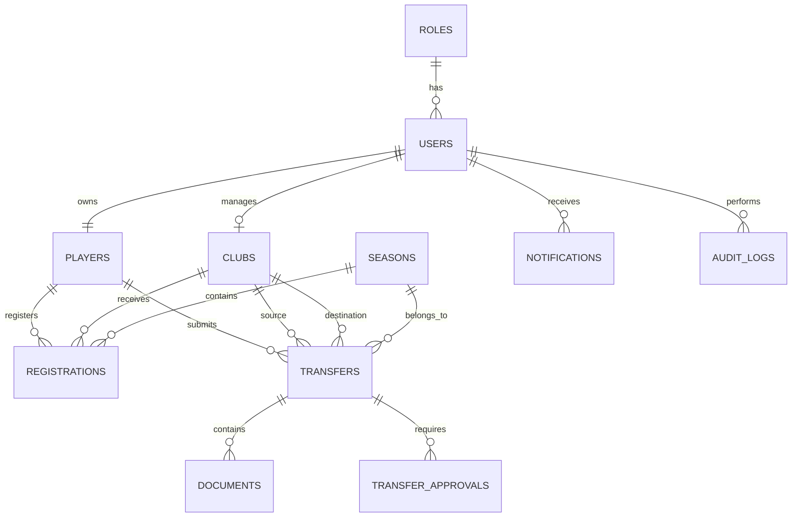

# Entity Relationship Diagram (ERD)

## Notes

- UUIDs are used as primary keys.
- PostgreSQL is hosted on Supabase.
- SQLAlchemy manages relationships.
- Documents are stored in Supabase Storage.
- Authentication is handled by Supabase Auth.