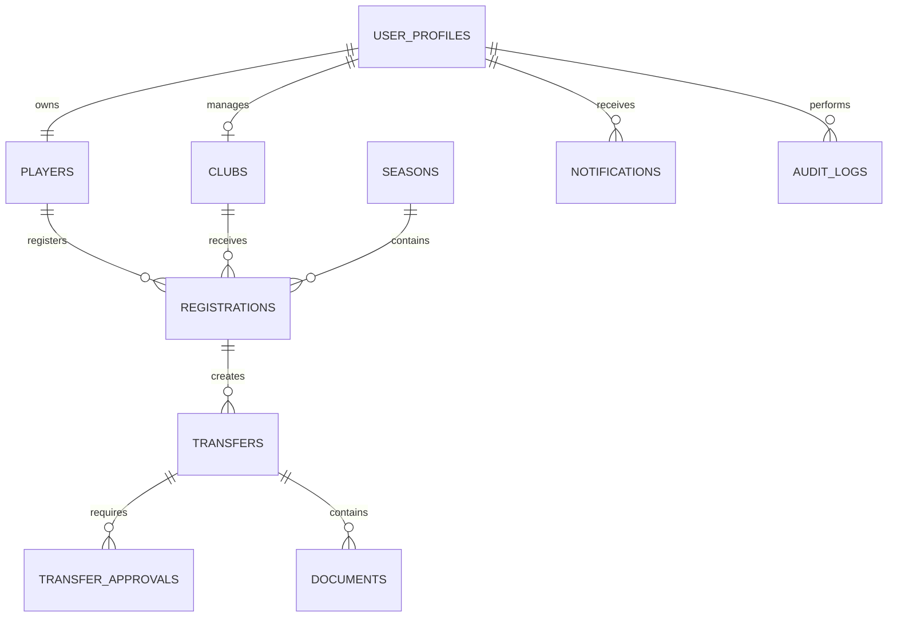

# Entity Relationship Diagram



## External Authentication

```
Supabase Auth

auth.users

        │
        ▼

user_profiles
```

Authentication is managed entirely by Supabase Auth.

Application data is stored inside PostgreSQL and accessed using SQLAlchemy.