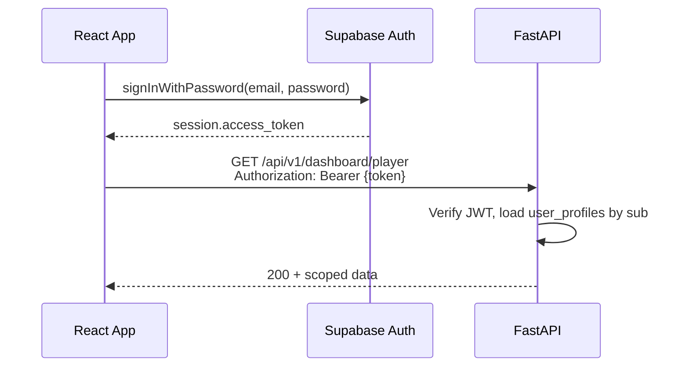

# Authentication — Supabase → FastAPI

Authentication is split across two systems:

1. **Supabase Auth** — login, signup, password reset (frontend only)
2. **FastAPI backend** — verifies the Supabase JWT and loads the KNCL `user_profiles` row for role/permissions

Users never send database credentials to the backend. Every protected request uses a **Bearer token**.

---

## Flow



### Important

- The JWT `sub` claim = Supabase `auth.users.id`
- The backend maps `sub` → `user_profiles.auth_user_id`
- If no profile exists → **403** `"No application profile exists for this authenticated user."`
- Application role lives on `user_profiles.role`, not in the JWT

---

## Supabase client setup (React)

```bash
npm install @supabase/supabase-js axios
```

```javascript
// src/lib/supabase.js
import { createClient } from "@supabase/supabase-js";

const supabaseUrl = import.meta.env.VITE_SUPABASE_URL;
const supabaseAnonKey = import.meta.env.VITE_SUPABASE_ANON_KEY;

export const supabase = createClient(supabaseUrl, supabaseAnonKey);
```

```env
# frontend/.env
VITE_SUPABASE_URL=https://your-project.supabase.co
VITE_SUPABASE_ANON_KEY=your-anon-key
VITE_API_BASE_URL=http://127.0.0.1:8000/api/v1
```

---

## Login example

```javascript
// src/services/authService.js
import { supabase } from "../lib/supabase";

export async function signIn(email, password) {
  const { data, error } = await supabase.auth.signInWithPassword({
    email,
    password,
  });
  if (error) throw error;
  return data.session; // contains access_token
}

export async function signOut() {
  await supabase.auth.signOut();
}

export async function getAccessToken() {
  const { data } = await supabase.auth.getSession();
  return data.session?.access_token ?? null;
}
```

---

## Axios client with Bearer token

```javascript
// src/services/api.js
import axios from "axios";
import { getAccessToken } from "./authService";

const api = axios.create({
  baseURL: import.meta.env.VITE_API_BASE_URL,
  headers: { "Content-Type": "application/json" },
});

api.interceptors.request.use(async (config) => {
  const token = await getAccessToken();
  if (token) {
    config.headers.Authorization = `Bearer ${token}`;
  }
  return config;
});

api.interceptors.response.use(
  (response) => response,
  (error) => {
    if (error.response?.status === 401) {
      // redirect to login or refresh session
    }
    return Promise.reject(error);
  }
);

export default api;
```

---

## Example authenticated request

```javascript
import api from "./api";

export async function fetchPlayerDashboard() {
  const { data } = await api.get("/dashboard/player");
  return data;
}
```

---

## Dev-only mock headers

When `AUTH_MOCK_ENABLED=true` and `APP_ENV=development`, the backend accepts mock headers **instead of** a Bearer token. Useful for frontend dev without Supabase wiring.

```
X-Mock-Role: PLAYER
X-Mock-User-ID: 33333333-3333-4333-8333-333333333305
X-Mock-Email: elias.mwangi@kncl.local
```

See [test-users.md](./test-users.md) for all seeded IDs.

**Do not use mock headers in production.**

---

## HTTP status codes (auth)

| Status | Meaning | Frontend action |
|--------|---------|-----------------|
| 401 | Missing/invalid token | Redirect to login |
| 403 | Valid token but no permission or no profile | Show access denied; check profile exists |
| 200 | Success | Render data |

---

## Session refresh

Supabase refreshes tokens automatically when using `supabase.auth.onAuthStateChange`. Re-read `session.access_token` before each API call (or use the interceptor pattern above) so Axios always sends a fresh token.

```javascript
supabase.auth.onAuthStateChange((_event, session) => {
  // update app auth context with session?.user
});
```
