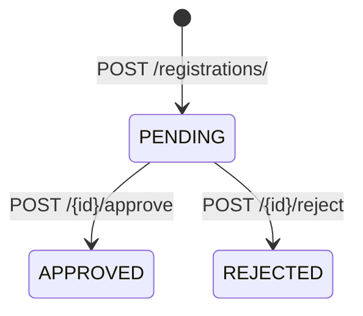
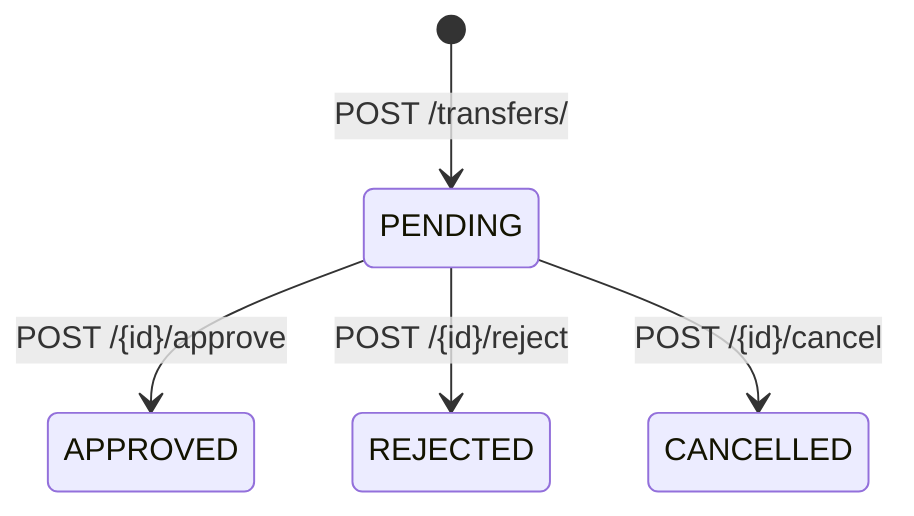

# Key Workflows — Frontend Integration

High-level flows the UI should implement. Full request/response shapes are in [`../endpoints.md`](../endpoints.md).

---

## 1. Dashboards (home screens)

| Role | Endpoint |
|------|----------|
| Player | `GET /dashboard/player` |
| Club admin | `GET /dashboard/club` |
| League / federation | `GET /dashboard/admin` |

Use these as the landing data source after login instead of aggregating multiple list calls.

---

## 2. Player profile & external accounts

### Load profile

```
GET /user-profiles/{id}     # own profile (scoped)
GET /players/{id}           # player record (scoped)
```

Player response includes `lichess_verified`, `chesscom_verified`, ratings, usernames.

### Preview username before saving

```
GET /integrations/lichess/users/{username}
GET /integrations/chesscom/users/{username}
```

Show ratings, title, country, games played. Chess.com usernames are case-insensitive (API lowercases automatically).

### Link username (club admin)

```
PATCH /players/{id}?sync_lichess=true
```

```json
{ "lichess_username": "my_lichess_handle" }
```

Backend validates the account exists. Verification is reset when username changes. Optional `sync_chesscom=true` for Chess.com.

### Verify ownership

**Lichess (bio code):**

1. `GET /players/{id}/lichess/verify` → returns `KNCL-XXXXXX`
2. User adds code to Lichess profile bio
3. `POST /players/{id}/lichess/verify` → confirms

**Chess.com (name match or admin):**

- `POST /players/{id}/chesscom/verify` — when Chess.com display name matches KNCL profile name
- `POST /players/{id}/chesscom/verify/admin` — club admin attestation

### Sync ratings

```
POST /players/{id}/lichess/sync
POST /players/{id}/chesscom/sync
```

### Compare stored vs live

```
GET /players/{id}/lichess
GET /players/{id}/chesscom
```

Returns `stored_ratings`, `live.ratings`, and `drift` per time control.

---

## 3. Registration workflow



### Submit (club leadership)

```http
POST /api/v1/registrations/
```

```json
{
  "player_id": "44444444-4444-4444-8444-444444444401",
  "club_id": "22222222-2222-4222-8222-222222222201",
  "season_id": "11111111-1111-4111-8111-111111111103"
}
```

Server sets `status: PENDING` and `registered_at`.

### Approve / reject (league leadership)

```http
POST /api/v1/registrations/{id}/approve
POST /api/v1/registrations/{id}/reject
```

```json
{ "remarks": "Optional note" }
```

Notifications and audit logs are created server-side.

---

## 4. Transfer workflow



### Submit (club leadership)

```http
POST /api/v1/transfers/
```

```json
{
  "registration_id": "66666666-6666-4666-8666-666666666601",
  "from_club_id": "22222222-2222-4222-8222-222222222202",
  "to_club_id": "22222222-2222-4222-8222-222222222203",
  "reason": "Seeking stronger training environment"
}
```

### Upload supporting document

```http
POST /api/v1/documents/upload
Content-Type: multipart/form-data
```

| Field | Type | Required |
|-------|------|----------|
| `transfer_id` | UUID | yes |
| `document_type` | string | no |
| `file` | file | yes |

Allowed: PDF, JPG, PNG, WEBP (max 10 MB). Response includes `download_url` (signed, time-limited).

### Approve (league leadership)

```http
POST /api/v1/transfers/{id}/approve
```

On approve: player's registration `club_id` updates, transfer approval record created, notification sent.

### Cancel (from club, pending only)

```http
POST /api/v1/transfers/{id}/cancel
```

### Update reason (pending only)

```http
PATCH /api/v1/transfers/{id}
```

```json
{ "reason": "Updated reason text" }
```

> Transfers have **no DELETE**. Terminal states cannot be changed.

---

## 5. Notifications

```
GET  /notifications/              # scoped; players see own
PATCH /notifications/{id}         # mark read
```

Player dashboard also returns recent notification summary.

---

## 6. Suggested page → API mapping

| Page | Primary endpoints |
|------|-------------------|
| Login | Supabase Auth (not backend) |
| Player dashboard | `/dashboard/player`, `/notifications/` |
| Player profile | `/user-profiles/{id}`, `/players/{id}`, `/integrations/*` |
| Register to club | `GET /seasons/`, `POST /registrations/` |
| Transfer request | `GET /registrations/`, `POST /transfers/`, `POST /documents/upload` |
| Club dashboard | `/dashboard/club`, `/transfers/`, `/registrations/` |
| Approvals | `POST /registrations/{id}/approve`, `POST /transfers/{id}/approve` |
| Admin dashboard | `/dashboard/admin`, `/audit-logs/` |
